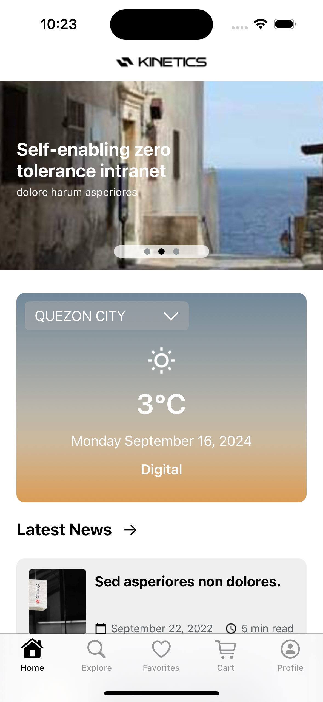
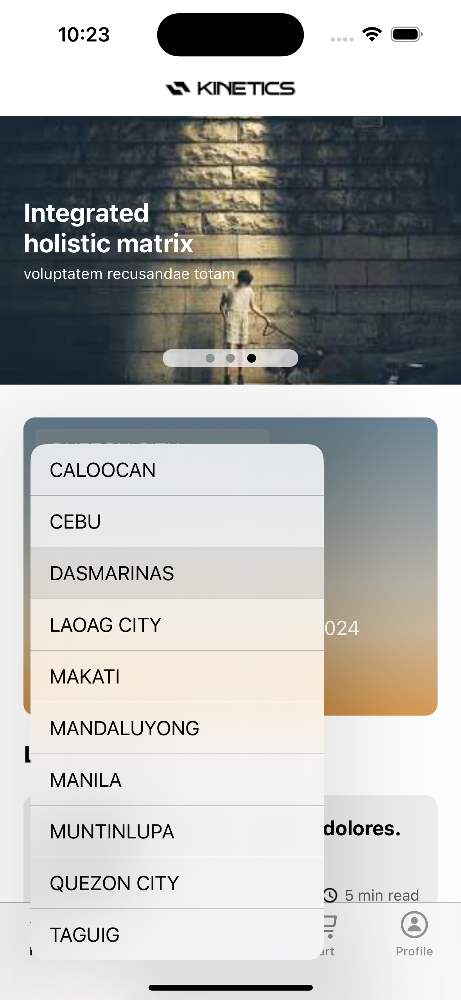
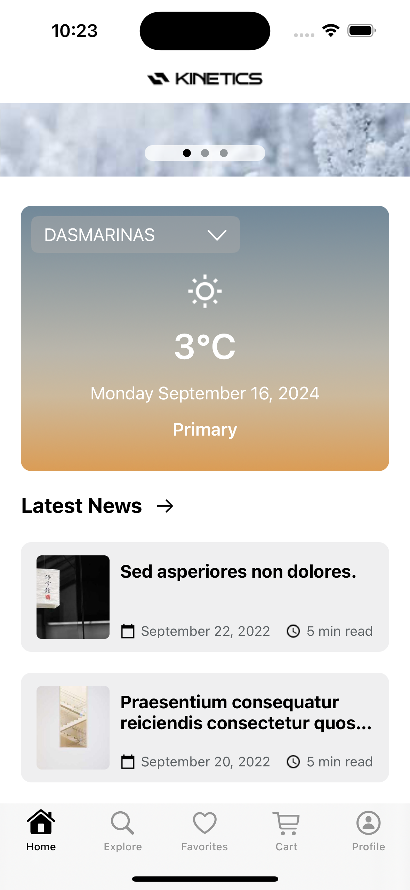
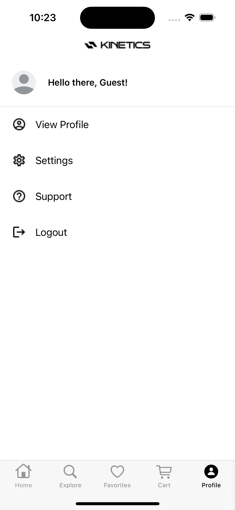
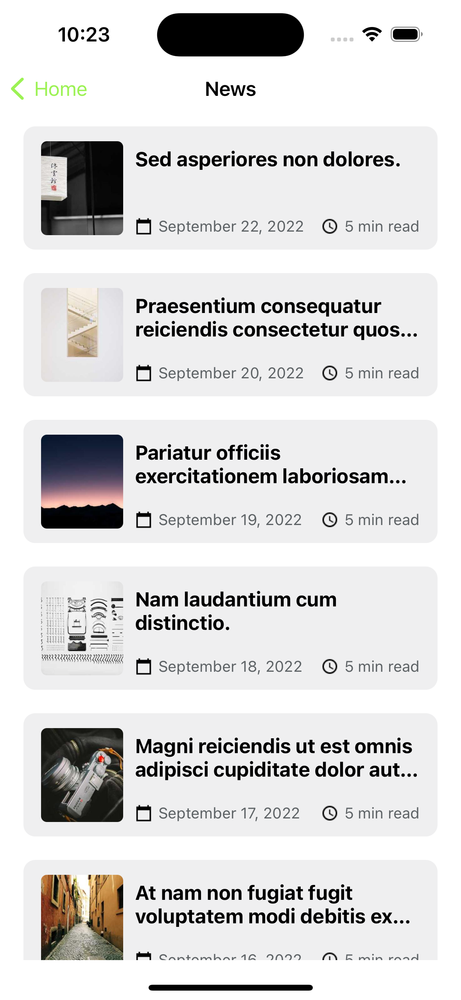
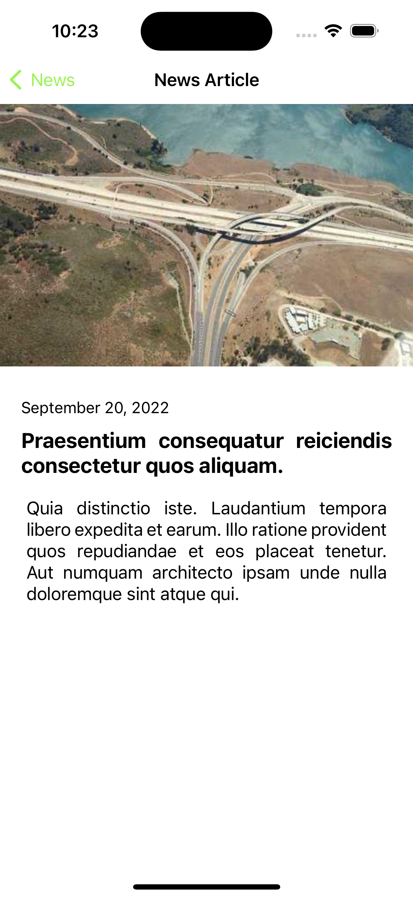
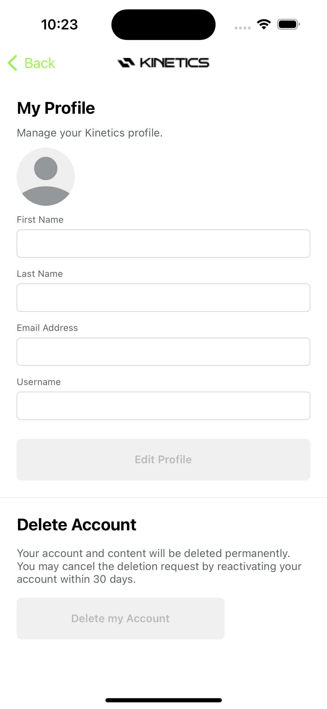

# Storyboarding Training

iOS development trainings in Swift.

## Features

- MVVM
- Remember Me
- API Integration
- Logger
- Coordinator Design Pattern for navigation
- Image Caching

## Requirements

- **IDE:** `XCode 14.3.1 for iOS 16.4`
- **Language:** `Swift 5`
- **Interface:** `Storyboard`

## Package Dependencies

- [KeychainSwift](https://github.com/evgenyneu/keychain-swift.git) `20.0.0`
- [Reachability](https://github.com/ashleymills/Reachability.swift) `master`
- [IQKeyboardManagerSwift](https://github.com/hackiftekhar/IQKeyboardManager.git) `6.5.12`

## Postman Mock URL

`https://672ef71b-4337-4ad9-946e-92699848933f.mock.pstmn.io`
	
## Screenshots

	 
	 
    
    
    

	
	
	

	
	

## Author

William Saberon Reña, [wilyamx@gmail.com](wilyamx@gmail.com)